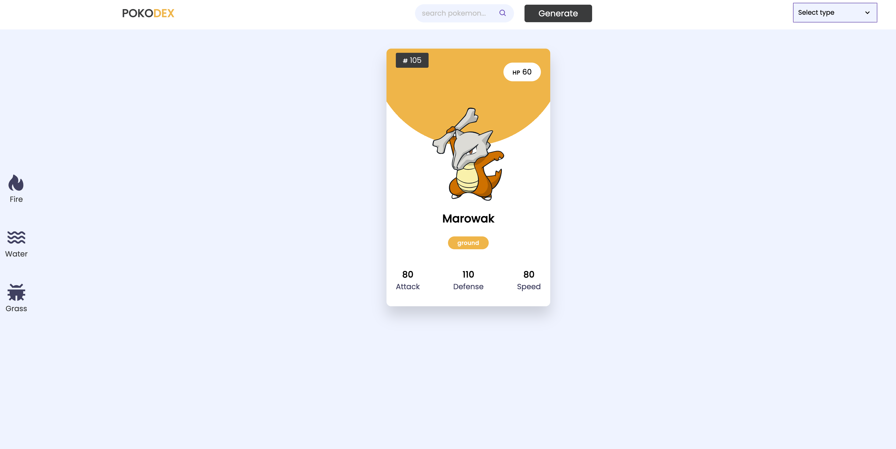

# Pokodex

This Pokodex App allows the user to search for a specific pokemon, filter pokemon by type, or view the main 3 pokemon types (fire, water, grass)

This application was developed to practice my knowledge with JavaScript and working with REST APIs

## Description

Generates a random pokemon on first load. Allows the user to type in search box to look up information about a specific pokemon. They can also use the dropdown menu to search for pokemon of a specific type. Will display all cards for pokemon that match that type.

### API Reference

[PokeAPI-v2](https://pokeapi.co/api/v2/")

## Design

